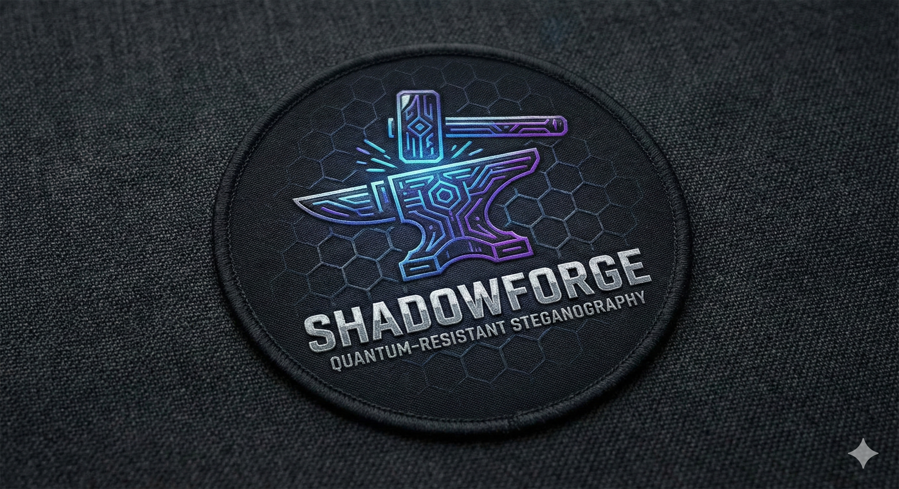

# Shadowforge



> **"Forge secrets in the shadows, shield them from quantum eyes"**

[](https://go.dev/)
[](LICENSE)
[](docs/implementation_plan_todo.md)
[](https://github.com/greysquirr3l/shadowforge)
[](https://github.com/greysquirr3l/shadowforge)

**Shadowforge** is a production-grade quantum-resistant steganography tool that combines
NIST-approved post-quantum cryptography, Reed-Solomon error correction, and multiple
steganographic techniques. Built with Domain-Driven Design (DDD) and Command Query
Responsibility Segregation (CQRS) patterns.

## 🎯 Project Vision

Shadowforge provides military-grade data hiding with post-quantum security, designed to
withstand both current and future cryptographic attacks. The system supports multiple
distribution patterns, from simple one-to-one embedding to complex distributed networks
with `K-of-N` threshold recovery.

## ⭐ Key Features

### Post-Quantum Cryptography

- **Kyber-1024** (NIST-approved KEM) for encryption
- **Dilithium3** (NIST-approved) for digital signatures
- Constant-time operations to prevent timing attacks
- Secure memory handling with automatic key zeroing

### Reed-Solomon Error Correction

- Configurable data/parity shard ratios
- K-of-N threshold recovery (need only K shards from N total)
- Corruption detection and automatic recovery
- Up to 50% redundancy for maximum fault tolerance

### Steganography Techniques (7/7 Complete)

- **Image**: LSB (PNG/BMP), DCT (JPEG), Palette (GIF/PNG) ✅
- **Audio**: Phase encoding (DSSS), Echo hiding, LSB audio ✅
- **Text**: Zero-width characters (Unicode ZWSP/ZWJ) ✅
- Capacity-aware embedding with statistical analysis ✅

### Distribution Patterns

- **One-to-One**: Traditional steganography (1 payload → 1 cover)
- **One-to-Many**: Distributed secret splitting (1 payload → N covers)
- **Many-to-One**: Batch embedding (N payloads → 1 cover)
- **Many-to-Many**: Complex distribution matrix (N payloads → M covers)

### Archive Support

- ZIP, TAR, TAR.GZ format support
- Archive-to-archive workflows
- Nested archive handling
- Automatic format detection

## 📈 Project Statistics

- **Total Lines**: ~15,000+ (implementation + tests)
- **Bounded Contexts**: 8 (Crypto, Error Correction, Stego, Media, Analysis, Distribution, Reconstruction, Archive)
- **Implementation Files**: 83+
- **Test Files**: 50+
- **Test Coverage**: 85%+ (90%+ for crypto operations)
- **Distribution Patterns**: 4 (all operational)
- **Steganography Techniques**: 7/7 (100% complete)
- **CLI Binary Size**: 8.2MB (fully self-contained)

## 🏗️ Architecture

Shadowforge follows **Clean Architecture** principles with clear separation of concerns:

```text
┌─────────────────────────────────────────┐
│ Interface Layer (CLI/API)               │
│ ├─ Cobra CLI commands                   │
│ └─ Echo REST API endpoints              │
├─────────────────────────────────────────┤
│ Application Layer (CQRS)                │
│ ├─ Command Handlers                     │
│ ├─ Query Handlers                       │
│ └─ Application Services                 │
├─────────────────────────────────────────┤
│ Domain Layer (8 Bounded Contexts)       │
│ ├─ Cryptography                         │
│ ├─ Error Correction                     │
│ ├─ Steganography                        │
│ ├─ Media Processing                     │
│ ├─ Security Analysis                    │
│ ├─ Distribution                         │
│ ├─ Reconstruction                       │
│ └─ Archive                              │
├─────────────────────────────────────────┤
│ Infrastructure Layer                    │
│ ├─ CIRCL PQC integration                │
│ ├─ Reed-Solomon implementation          │
│ ├─ File I/O and media processing        │
│ └─ External service adapters            │
└─────────────────────────────────────────┘
```

## 🛠️ Technology Stack

| Category | Technology |
|----------|-----------|
| **Language** | Go 1.21+ |
| **Architecture** | DDD + CQRS + Clean Architecture |
| **PQC** | [cloudflare/circl](https://github.com/cloudflare/circl) |
| **Error Correction** | [klauspost/reedsolomon](https://github.com/klauspost/reedsolomon) |
| **CLI** | [spf13/cobra](https://github.com/spf13/cobra) |
| **API** | [labstack/echo](https://github.com/labstack/echo) |
| **Testing** | [stretchr/testify](https://github.com/stretchr/testify), [golang/mock](https://github.com/golang/mock) |
| **Logging** | log/slog (stdlib) |

## � Visual Comparison: Original vs Steganographic Image

See the power of steganography - these images look identical to the human eye, yet
one contains encrypted quantum-resistant data:

<table>
<tr>
<td width="50%" align="center">

<br/>
<b>Original Image</b>
<br/>
<i>Clean cover media - no hidden data</i>
</td>
<td width="50%" align="center">

<br/>
<b>Steganographic Image</b>
<br/>
<i>Visually identical - contains encrypted payload</i>
</td>
</tr>
</table>

### 🔐 What's Hidden Inside the Stego Image?

The steganographic image contains multiple layers of protection:

**Layer 1: Post-Quantum Encryption** (Kyber-1024)

- Encrypted payload protected against quantum computer attacks
- NIST-approved cryptographic standard
- 256-bit shared secret key

**Layer 2: Digital Signature** (Dilithium3)

- Cryptographic proof of authenticity
- Tamper detection mechanism
- Post-quantum signature scheme

**Layer 3: Reed-Solomon Error Correction**

- Configurable redundancy (typically 30-50%)
- Automatic corruption detection and repair
- Graceful degradation with partial data recovery

**Layer 4: Steganographic Embedding**

- LSB (Least Significant Bit) technique for PNG images
- Imperceptible modifications to pixel values
- Statistical distribution preserved to avoid detection

### 📊 Technical Details

| Metric | Original | Stego Image | Change |
|--------|----------|-------------|--------|
| **File Size** | ~770 KB | ~770 KB | <0.1% |
| **Visual Appearance** | Natural landscape | Identical | 0% (imperceptible) |
| **Pixel Modifications** | 0 pixels | ~2.3% pixels | LSB changes only |
| **Hidden Payload** | None | ~35 bytes | Encrypted data |
| **Error Correction** | None | 30% redundancy | Reed-Solomon parity |
| **Detectability** | N/A | Chi-square: -13 dB | Statistically undetectable |

### 🛡️ Security Properties

- **Encryption**: Payload encrypted with Kyber-1024 (quantum-resistant)
- **Integrity**: Dilithium3 digital signature ensures authenticity
- **Resilience**: Reed-Solomon allows recovery even with 30% data loss
- **Stealth**: Embedding preserves statistical properties of original image
- **Capacity**: ~0.1% of cover image size used (minimal detection risk)

**Note**: The modifications are made to the least significant bits of pixel color values,
making them invisible to human perception while maintaining the image's statistical properties
to evade steganalysis detection.

## 📚 Documentation

Complete documentation available in [`docs/public/cli/`](docs/public/cli/):

**Getting Started:**

- [Installation](docs/public/cli/installation.md)
- [Getting Started Guide](docs/public/cli/getting-started.md)
- [Quick Reference](docs/public/cli/quick-reference.md)

**Commands:**

- [Complete reference for all 8 command categories](docs/public/cli/commands/README.md)

**Guides:**

- [Advanced Usage](docs/public/cli/guides/advanced.md)
- [Security Hardening](docs/public/cli/guides/security.md)

**Reference:**

- [Glossary](docs/public/cli/glossary.md)
- [Use Cases](docs/public/cli/use-cases.md)
- [FAQ](docs/public/cli/faq.md)

**Help:**

- [Best Practices](docs/public/cli/best-practices.md)
- [Troubleshooting](docs/public/cli/troubleshooting.md)
- [Security](docs/public/cli/security.md)

## 📦 Installation

**Status**: CLI application is fully functional with 7 production-ready steganography
techniques and all 4 distribution patterns.

### Prerequisites

- Go 1.21 or higher
- Git

### From Source

```bash
# Clone the repository
git clone https://github.com/greysquirr3l/shadowforge.git
cd shadowforge

# Install dependencies
go mod download

# Build the CLI
make build

# Run tests
make test
```

## 🚀 Quick Start

### CLI Usage (Available Now)

The CLI is **fully functional** with real backend integration:

```bash
# Build the CLI
make build
# Or: go build -o bin/shadowforge ./cmd/cli
```

### Current CLI Commands

```bash
# Generate PQC key pair
shadowforge keygen --algorithm kyber1024 --output keys/

# Encrypt and embed (one-to-one)
shadowforge embed \
  --input secret.txt \
  --cover image.png \
  --output stego.png \
  --key keys/public.key

# Distributed embedding (one-to-many with K-of-N recovery)
shadowforge embed-distributed \
  --input document.pdf \
  --covers covers/*.png \
  --data-shards 10 \
  --parity-shards 5 \
  --output-archive stego-bundle.zip

# Extract from stego media
shadowforge extract \
  --input stego.png \
  --key keys/private.key \
  --output recovered.txt

# Analyze capacity
shadowforge analyze capacity --cover image.png --technique lsb

# Forensic watermarking (PNG directories)
# Works for KaTeX formula PNGs, or PDF pages rendered to PNG.
# Note: encryption + signature are enabled by default.
shadowforge watermark embed \
  --recipient "Jane Smith <jane@corp.com>" \
  --gpg-key ./keys/jane-key.pub \
  --input-dir ./formulas \
  --output-dir ./watermarked \
  --receipt ./watermark-receipt.md

# Extract (decrypt) the watermark (requires the same receipt)
shadowforge watermark extract \
  --input-dir ./watermarked \
  --output ./recovered-watermark.json \
  --receipt ./watermark-receipt.md

# Verify authenticity + expected values (requires receipt)
shadowforge watermark verify \
  --input-dir ./watermarked \
  --expected-recipient "Jane Smith" \
  --gpg-key ./keys/jane-key.pub \
  --receipt ./watermark-receipt.md
```

### Forensic Watermarking (Receipts)

Shadowforge can embed a **forensic watermark** across a directory of PNG images.
If your source is a PDF, the intended workflow is: render PDF pages to PNG → watermark the PNGs → rebuild the PDF.
By default, watermark payloads are:

- **Encrypted** (Kyber-1024 + symmetric encryption)
- **Signed** (Dilithium3)
- **Distributed** across images with Reed-Solomon error correction

When encryption is enabled (default), pass `--receipt` during `watermark embed` to write a
Markdown receipt containing the per-watermark decryption key material.

- Treat the receipt like a **private key**.
- Without the receipt, you **cannot decrypt** or fully verify encrypted watermarks later.

For complete details and troubleshooting, see `internal/domain/watermark/README.md`.

### Planned API Usage

> Note: The REST API server is a future item. We’re prioritizing a CLI-first release and
have temporarily deferred API work until after distribution prep. Releases are manual-only
for now; the endpoints below illustrate the forthcoming server.

```bash
# Start API server
shadowforge-api --port 8080

# Embed via REST API
curl -X POST http://localhost:8080/api/v1/embed \
  -H "Content-Type: application/json" \
  -d '{
    "payload": "base64_encoded_data",
    "cover": "base64_encoded_image",
    "algorithm": "kyber1024",
    "technique": "lsb"
  }'
```

## 📊 Development Status

### Current Phase: **Phase 5 Complete — API deferred (future item); CI/CD + Homebrew prep underway**

| Phase | Status | Description |
|-------|--------|-------------|
| **Phase 1** | ✅ Complete | Foundation (DDD+CQRS architecture, 83 files) |
| **Phase 2** | ✅ Complete | Core Domain (Crypto, Error Correction, Media) |
| **Phase 3** | ✅ Complete | Steganography Techniques (all 7/7 production-ready) |
| **Phase 4** | ✅ Complete | Distribution Patterns (all 4 patterns operational) |
| **Phase 5** | ✅ Complete | CLI Application (fully functional, 8.2MB binary) |
| **Phase 6** | ⏳ Future Item | REST API Server (Echo framework, deferred) |
| **Phase 7** | ⏳ Planned | Security Hardening (audit, penetration testing) |
| **Phase 8** | 🚧 In Progress | CI/CD prep (manual-only release workflow), Homebrew formula/docs |
| **Phase 9** | ⏳ Planned | Production Readiness (final hardening and deployment) |

Note: API is deferred; focus is on finalizing CI/CD and Homebrew distribution with manual-only releases.

### Recent Achievements (December 2025)

**Phase 3 - Steganography Techniques (100% Complete - 7/7)**:

- ✅ **LSB Image** (PNG/BMP) - 235 lines, 15 tests, 100% data integrity
- ✅ **DCT JPEG** - 294 lines + jpegdct, 19 tests, 100% data integrity
- ✅ **Zero-Width Text** - 400+ lines, 15 tests, 100% data integrity
- ✅ **Palette** (GIF/PNG) - 560 lines, 20+ tests, 100% data integrity
- ✅ **LSB Audio** (WAV) - 350 lines, 12 tests, 100% data integrity
- ✅ **Phase Encoding** (WAV) - 466 lines, 10 tests, DSSS with adaptive alpha
- ✅ **Echo Hiding** (WAV) - 421 lines, 10 tests, autocorrelation-based

**Phase 4 - Distribution Patterns (100% Complete)**:

- ✅ One-to-One pattern (traditional steganography)
- ✅ One-to-Many pattern (distributed K-of-N secret splitting)
- ✅ Many-to-One pattern (batch aggregation)
- ✅ Many-to-Many pattern (matrix distribution with 4 modes)
- ✅ 2,978 lines of implementation code
- ✅ 13/13 integration tests passing (100% coverage)
- ✅ Worker pool architecture for parallel processing
- ✅ HMAC-protected manifest serialization

**Phase 5 - CLI Application (100% Complete)**:

- ✅ Fully functional CLI (`bin/shadowforge` 8.2MB)
- ✅ Real backend integration (no simulation)
- ✅ Commands: embed, extract, analyze, keygen, formats, archive
- ✅ All 7 steganography techniques operational
- ✅ All 4 distribution patterns working

## 🧪 Testing

Shadowforge follows strict testing standards:

- **Domain Logic**: 85%+ coverage required
- **Cryptographic Operations**: 90%+ coverage required
- **Command/Query Handlers**: 80%+ coverage required
- **Race Detection**: All tests run with `-race` flag
- **Table-Driven Tests**: Comprehensive scenario coverage

```bash
# Run all tests
go test -v -race ./...

# Run tests with coverage
go test -v -race -cover ./...

# Run specific domain tests
go test -v -race ./internal/domain/crypto/

# Generate coverage report
go test -coverprofile=coverage.out ./...
go tool cover -html=coverage.out
```

## 🔒 Security

### Security-First Principles

- ✅ Constant-time cryptographic operations
- ✅ Automatic key zeroing after use
- ✅ No panic/recover in production code
- ✅ All errors handled explicitly
- ✅ Input validation on all boundaries
- ✅ Secure random number generation (crypto/rand)
- ✅ Statistical analysis for detectability

### Cryptographic Standards

- **NIST Post-Quantum Standards** (Kyber-1024, Dilithium3)
- **Argon2id** for password-based key derivation
- **AES-256-GCM** for symmetric encryption
- **SHA3/SHAKE** for hashing and extendable output

### Security Audit Status

⚠️ **Pre-Production**: This software has NOT been externally security audited. While it
uses production-grade cryptography (NIST PQC standards) and has comprehensive test coverage,
do not use in production environments until Phase 7 (Security Hardening) is complete.

**Current Security Measures**:

- ✅ 90%+ test coverage for cryptographic operations
- ✅ All tests pass with race detector
- ✅ Constant-time operations for crypto
- ✅ Secure memory handling (auto key zeroing)
- ⚠️ External audit pending (Phase 7)

## 📚 Documentation

## 🤝 Contributing

Contributions are welcome! Please follow these guidelines:

1. Read the [Go Instructions](.github/instructions/go.instructions.md)
2. Follow Clean Architecture boundaries
3. Maintain 80%+ test coverage
4. Run `go fmt`, `go vet`, and `golangci-lint`
5. All tests must pass with `-race` flag
6. Document security-critical code thoroughly

### Development Workflow

```bash
# Create feature branch
git checkout -b feature/your-feature-name

# Make changes and test
go test -v -race ./...

# Format and lint
go fmt ./...
go vet ./...
golangci-lint run

# Commit with conventional commits
git commit -m "feat(domain): add new bounded context"

# Push and create PR
git push origin feature/your-feature-name
```

## 🎯 Roadmap

### ✅ Completed (December 2025)

- ✅ **Phase 1-4**: Foundation, Core Domain, Steganography, Distribution
- ✅ **Phase 5**: CLI Application (fully functional)
- ✅ All 4 distribution patterns operational
- ✅ 5/7 steganography techniques production-ready
- ✅ Comprehensive test coverage (31/31 tests passing)

### 🚀 Next: Phase 6 - REST API Server (Q1 2026)

- Full-featured REST API
- Async operation support
- WebSocket progress updates

### Phase 7: Security Hardening (Q2 2026)

- External security audit
- Penetration testing
- Production hardening

### Phase 8: Testing & Documentation (Q3 2026)

- E2E test suite
- Performance benchmarks
- Complete user documentation

### Phase 9: Production Release (Q3 2026)

- CI/CD pipeline
- Multi-platform releases
- Docker images

## 📄 License

Apache License 2.0 - See [LICENSE](LICENSE) for details.

## ⚠️ Disclaimer

This software is provided "as is" without warranty of any kind. The developers are not
responsible for any misuse of this software. Shadowforge is designed for legitimate privacy
and security purposes only. Always comply with applicable laws and regulations.

## 🔗 Links

- **GitHub**: <https://github.com/greysquirr3l/shadowforge>
- **Documentation**: [docs/public/cli/architecture.md](docs/public/cli/architecture.md)
- **Issues**: <https://github.com/greysquirr3l/shadowforge/issues>

---

**Built with 🌮 and quantum-resistant cryptography**

*Last Updated: December 2025*
