# Shadowforge Architecture

> **"Forge secrets in the shadows, shield them from quantum eyes"**

A comprehensive architecture document for Shadowforge, a production-grade quantum-resistant steganography tool built with Domain-Driven Design (DDD) and CQRS patterns.

---

## 📋 Table of Contents

- [System Overview](#system-overview)
- [High-Level Architecture](#high-level-architecture)
- [Domain-Driven Design](#domain-driven-design)
- [CQRS Implementation](#cqrs-implementation)
- [Security Pipeline](#security-pipeline)
- [Distribution Patterns](#distribution-patterns)
- [Data Flow Diagrams](#data-flow-diagrams)
- [Component Interactions](#component-interactions)
- [Technology Stack](#technology-stack)

---

## System Overview

Shadowforge is a quantum-resistant steganography system that combines:

- **Post-Quantum Cryptography** (NIST-approved Kyber-1024, Dilithium3)
- **Reed-Solomon Error Correction** for data resilience
- **Multiple Steganography Techniques** (LSB, DCT, Audio Phase, Text)
- **Flexible Distribution Patterns** (1:1, 1:N, N:1, N:M)

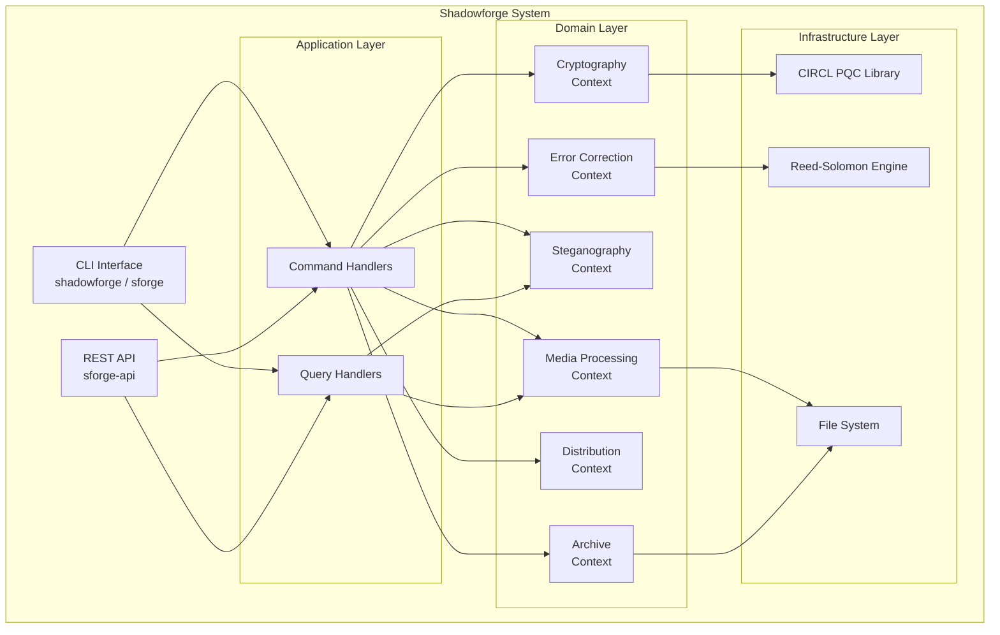
```mermaid
graph TB
    subgraph "Shadowforge System"
        CLI[CLI Interface<br/>shadowforge / sforge]
        API[REST API<br/>sforge-api]

        subgraph "Application Layer"
            Commands[Command Handlers]
            Queries[Query Handlers]
        end

        subgraph "Domain Layer"
            Crypto[Cryptography<br/>Context]
            EC[Error Correction<br/>Context]
            Stego[Steganography<br/>Context]
            Media[Media Processing<br/>Context]
            Dist[Distribution<br/>Context]
            Archive[Archive<br/>Context]
        end

        subgraph "Infrastructure Layer"
            PQC[CIRCL PQC Library]
            RS[Reed-Solomon Engine]
            FS[File System]
        end
    end

    CLI --> Commands
    CLI --> Queries
    API --> Commands
    API --> Queries

    Commands --> Crypto
    Commands --> EC
    Commands --> Stego
    Commands --> Media
    Commands --> Dist
    Commands --> Archive

    Queries --> Media
    Queries --> Stego

    Crypto --> PQC
    EC --> RS
    Media --> FS
    Archive --> FS
```

---

## High-Level Architecture

### Clean Architecture Layers

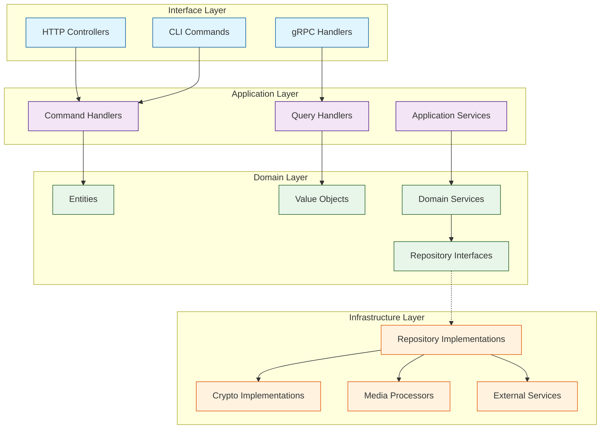
```mermaid
graph TB
    subgraph "Interface Layer"
        direction LR
        HTTP[HTTP Controllers]
        CLICmd[CLI Commands]
        gRPC[gRPC Handlers]
    end

    subgraph "Application Layer"
        direction LR
        CmdHandlers[Command Handlers]
        QryHandlers[Query Handlers]
        AppServices[Application Services]
    end

    subgraph "Domain Layer"
        direction LR
        Entities[Entities]
        ValueObjects[Value Objects]
        DomainServices[Domain Services]
        RepoInterfaces[Repository Interfaces]
    end

    subgraph "Infrastructure Layer"
        direction LR
        CryptoImpl[Crypto Implementations]
        MediaImpl[Media Processors]
        RepoImpl[Repository Implementations]
        External[External Services]
    end

    HTTP --> CmdHandlers
    CLICmd --> CmdHandlers
    gRPC --> QryHandlers

    CmdHandlers --> Entities
    QryHandlers --> ValueObjects
    AppServices --> DomainServices

    DomainServices --> RepoInterfaces
    RepoInterfaces -.-> RepoImpl

    RepoImpl --> CryptoImpl
    RepoImpl --> MediaImpl
    RepoImpl --> External

    classDef interface fill:#e1f5fe,stroke:#01579b
    classDef application fill:#f3e5f5,stroke:#4a148c
    classDef domain fill:#e8f5e9,stroke:#1b5e20
    classDef infrastructure fill:#fff3e0,stroke:#e65100

    class HTTP,CLICmd,gRPC interface
    class CmdHandlers,QryHandlers,AppServices application
    class Entities,ValueObjects,DomainServices,RepoInterfaces domain
    class CryptoImpl,MediaImpl,RepoImpl,External infrastructure
```

### Project Structure

```text
shadowforge/
├── cmd/
│   ├── cli/                    # CLI application (shadowforge/sforge)
│   │   └── main.go
│   └── api/                    # REST API application
│       └── main.go
├── internal/
│   ├── domain/                 # Domain layer (core business logic)
│   │   ├── crypto/             # Cryptography bounded context
│   │   ├── errorcorrection/    # Reed-Solomon context
│   │   ├── stego/              # Steganography context
│   │   ├── media/              # Media processing context
│   │   ├── distribution/       # Distribution patterns context
│   │   ├── reconstruction/     # Shard reconstruction context
│   │   └── archive/            # Archive handling context
│   ├── application/            # Application layer (CQRS)
│   │   ├── commands/           # Command handlers
│   │   ├── queries/            # Query handlers
│   │   └── services/           # Application services
│   ├── infrastructure/         # Infrastructure layer
│   │   ├── crypto/             # PQC implementations
│   │   ├── media/              # Media file handlers
│   │   ├── storage/            # File system operations
│   │   └── config/             # Configuration management
│   └── interfaces/             # Interface layer
│       ├── cli/                # CLI handlers
│       ├── api/                # REST API handlers
│       └── dto/                # Data transfer objects
├── pkg/                        # Public library code
├── tests/                      # Test files
└── docs/                       # Documentation
```

---

## Domain-Driven Design

### Bounded Contexts


```mermaid
graph TB
    subgraph "Cryptography Context"
        CryptoAgg[CryptoPayload<br/>Aggregate]
        EncData[EncryptedData]
        KeyPair[KeyPair]
        Signature[Signature]

        CryptoAgg --> EncData
        CryptoAgg --> KeyPair
        CryptoAgg --> Signature
    end

    subgraph "Error Correction Context"
        ECMsg[ProtectedMessage<br/>Aggregate]
        EncMsg[EncodedData]
        Parity[ParityShards]

        ECMsg --> EncMsg
        ECMsg --> Parity
    end

    subgraph "Steganography Context"
        StegoContainer[StegoContainer<br/>Aggregate]
        Cover[CoverMedia]
        Payload[EmbeddedPayload]
        EmbedMap[EmbeddingMap]

        StegoContainer --> Cover
        StegoContainer --> Payload
        StegoContainer --> EmbedMap
    end

    subgraph "Media Processing Context"
        MediaAsset[MediaAsset<br/>Aggregate]
        ImageFile[ImageFile]
        AudioFile[AudioFile]
        TextFile[TextFile]

        MediaAsset --> ImageFile
        MediaAsset --> AudioFile
        MediaAsset --> TextFile
    end

    subgraph "Security Analysis Context"
        SecAnalysis[SecurityAnalysis<br/>Aggregate]
        ChiSquare[ChiSquareTest]
        RSAnalysis[RSAnalysis]
        DetectScore[DetectabilityScore]

        SecAnalysis --> ChiSquare
        SecAnalysis --> RSAnalysis
        SecAnalysis --> DetectScore
    end

    subgraph "Distribution Context"
        DistStrategy[DistributionStrategy<br/>Aggregate]
        Manifest[ShardManifest]
        ShardMap[ShardMapping]
        Plan[DistributionPlan]

        DistStrategy --> Manifest
        DistStrategy --> ShardMap
        DistStrategy --> Plan
    end

    subgraph "Reconstruction Context"
        ReconSession[ReconstructionSession<br/>Aggregate]
        ShardColl[ShardCollection]
        RecoveryAttempt[RecoveryAttempt]
        RecoveryStatus[RecoveryStatus]

        ReconSession --> ShardColl
        ReconSession --> RecoveryAttempt
        ReconSession --> RecoveryStatus
    end

    subgraph "Archive Context"
        ArchiveAgg[Archive<br/>Aggregate]
        Container[ArchiveContainer]
        Entry[ArchiveEntry]

        ArchiveAgg --> Container
        ArchiveAgg --> Entry
    end

    CryptoAgg -.->|encrypts| ECMsg
    ECMsg -.->|encodes| StegoContainer
    StegoContainer -.->|embeds in| MediaAsset
    SecAnalysis -.->|analyzes| StegoContainer
    DistStrategy -.->|coordinates| StegoContainer
    ReconSession -.->|reconstructs from| DistStrategy
    ArchiveAgg -.->|packages| MediaAsset
```

### Aggregate Relationships

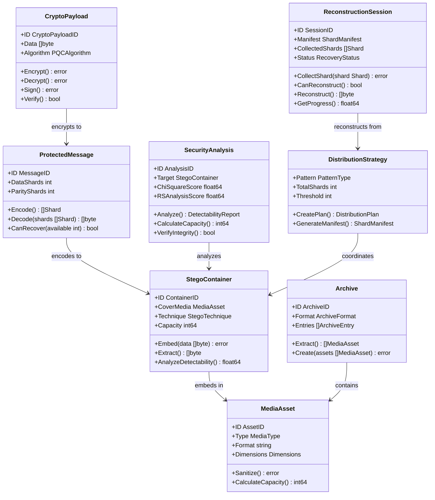
```mermaid
classDiagram
    class CryptoPayload {
        +ID CryptoPayloadID
        +Data []byte
        +Algorithm PQCAlgorithm
        +Encrypt() error
        +Decrypt() error
        +Sign() error
        +Verify() bool
    }

    class ProtectedMessage {
        +ID MessageID
        +DataShards int
        +ParityShards int
        +Encode() []Shard
        +Decode(shards []Shard) []byte
        +CanRecover(available int) bool
    }

    class StegoContainer {
        +ID ContainerID
        +CoverMedia MediaAsset
        +Technique StegoTechnique
        +Capacity int64
        +Embed(data []byte) error
        +Extract() []byte
        +AnalyzeDetectability() float64
    }

    class MediaAsset {
        +ID AssetID
        +Type MediaType
        +Format string
        +Dimensions Dimensions
        +Sanitize() error
        +CalculateCapacity() int64
    }

    class DistributionStrategy {
        +Pattern PatternType
        +TotalShards int
        +Threshold int
        +CreatePlan() DistributionPlan
        +GenerateManifest() ShardManifest
    }

    class Archive {
        +ID ArchiveID
        +Format ArchiveFormat
        +Entries []ArchiveEntry
        +Extract() []MediaAsset
        +Create(assets []MediaAsset) error
    }

    class SecurityAnalysis {
        +ID AnalysisID
        +Target StegoContainer
        +ChiSquareScore float64
        +RSAnalysisScore float64
        +Analyze() DetectabilityReport
        +CalculateCapacity() int64
        +VerifyIntegrity() bool
    }

    class ReconstructionSession {
        +ID SessionID
        +Manifest ShardManifest
        +CollectedShards []Shard
        +Status RecoveryStatus
        +CollectShard(shard Shard) error
        +CanReconstruct() bool
        +Reconstruct() []byte
        +GetProgress() float64
    }

    CryptoPayload --> ProtectedMessage : encrypts to
    ProtectedMessage --> StegoContainer : encodes to
    StegoContainer --> MediaAsset : embeds in
    SecurityAnalysis --> StegoContainer : analyzes
    DistributionStrategy --> StegoContainer : coordinates
    ReconstructionSession --> DistributionStrategy : reconstructs from
    Archive --> MediaAsset : contains
```

### Domain Events

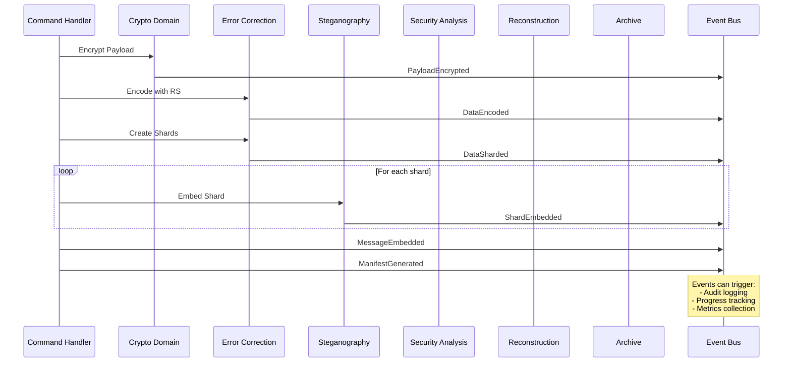
```mermaid
sequenceDiagram
    participant Cmd as Command Handler
    participant Crypto as Crypto Domain
    participant EC as Error Correction
    participant Stego as Steganography
    participant Analysis as Security Analysis
    participant Recon as Reconstruction
    participant Archive as Archive
    participant EventBus as Event Bus

    Cmd->>Crypto: Encrypt Payload
    Crypto->>EventBus: PayloadEncrypted

    Cmd->>EC: Encode with RS
    EC->>EventBus: DataEncoded

    Cmd->>EC: Create Shards
    EC->>EventBus: DataSharded

    loop For each shard
        Cmd->>Stego: Embed Shard
        Stego->>EventBus: ShardEmbedded
    end

    Cmd->>EventBus: MessageEmbedded
    Cmd->>EventBus: ManifestGenerated

    Note over EventBus: Events can trigger:<br/>- Audit logging<br/>- Progress tracking<br/>- Metrics collection
```

### Domain Event Catalog

| Event | Context | Description |
|-------|---------|-------------|
| `PayloadEncrypted` | Cryptography | Payload encrypted with Kyber KEM |
| `DataEncoded` | Error Correction | Reed-Solomon encoding complete |
| `DataSharded` | Distribution | Data split into shards |
| `ShardEmbedded` | Steganography | Single shard embedded in carrier |
| `MessageEmbedded` | Steganography | Full message embedding complete |
| `ShardExtracted` | Steganography | Single shard extracted from carrier |
| `MessageExtracted` | Steganography | Full message extraction complete |
| `ShardsReconstructed` | Reconstruction | Shards reassembled |
| `IntegrityVerified` | Security Analysis | Digital signature verified |
| `CorruptionDetected` | Error Correction | Data corruption found |
| `ManifestGenerated` | Distribution | Shard manifest created |
| `RecoveryCompleted` | Reconstruction | Partial recovery successful |
| `ArchiveExtracted` | Archive | Archive contents extracted |
| `ArchiveCreated` | Archive | New archive packaged |
| `MediaExtractedFromArchive` | Archive | Media file extracted from archive |
| `StegoMediaPackaged` | Archive | Stego media added to archive |

---

## CQRS Implementation

### Command Flow

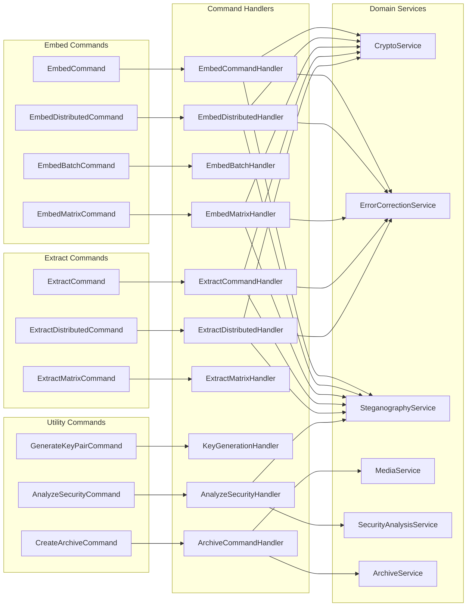
```mermaid
graph LR
    subgraph "Embed Commands"
        EmbedCmd[EmbedCommand]
        EmbedDistCmd[EmbedDistributedCommand]
        EmbedBatchCmd[EmbedBatchCommand]
        EmbedMatrixCmd[EmbedMatrixCommand]
    end

    subgraph "Extract Commands"
        ExtractCmd[ExtractCommand]
        ExtractDistCmd[ExtractDistributedCommand]
        ExtractMatrixCmd[ExtractMatrixCommand]
    end

    subgraph "Utility Commands"
        KeyGenCmd[GenerateKeyPairCommand]
        ArchiveCmd[CreateArchiveCommand]
        AnalyzeCmd[AnalyzeSecurityCommand]
    end

    subgraph "Command Handlers"
        EmbedHandler[EmbedCommandHandler]
        EmbedDistHandler[EmbedDistributedHandler]
        EmbedBatchHandler[EmbedBatchHandler]
        EmbedMatrixHandler[EmbedMatrixHandler]
        ExtractHandler[ExtractCommandHandler]
        ExtractDistHandler[ExtractDistributedHandler]
        ExtractMatrixHandler[ExtractMatrixHandler]
        KeyGenHandler[KeyGenerationHandler]
        ArchiveHandler[ArchiveCommandHandler]
        AnalyzeHandler[AnalyzeSecurityHandler]
    end

    subgraph "Domain Services"
        CryptoSvc[CryptoService]
        ECSvc[ErrorCorrectionService]
        StegoSvc[SteganographyService]
        MediaSvc[MediaService]
        AnalysisSvc[SecurityAnalysisService]
        ArchiveSvc[ArchiveService]
    end

    EmbedCmd --> EmbedHandler
    EmbedDistCmd --> EmbedDistHandler
    EmbedBatchCmd --> EmbedBatchHandler
    EmbedMatrixCmd --> EmbedMatrixHandler
    ExtractCmd --> ExtractHandler
    ExtractDistCmd --> ExtractDistHandler
    ExtractMatrixCmd --> ExtractMatrixHandler
    KeyGenCmd --> KeyGenHandler
    ArchiveCmd --> ArchiveHandler
    AnalyzeCmd --> AnalyzeHandler

    EmbedHandler --> CryptoSvc
    EmbedHandler --> ECSvc
    EmbedHandler --> StegoSvc

    EmbedDistHandler --> CryptoSvc
    EmbedDistHandler --> ECSvc
    EmbedDistHandler --> StegoSvc

    EmbedMatrixHandler --> CryptoSvc
    EmbedMatrixHandler --> ECSvc
    EmbedMatrixHandler --> StegoSvc

    ExtractHandler --> StegoSvc
    ExtractHandler --> ECSvc
    ExtractHandler --> CryptoSvc

    ExtractDistHandler --> StegoSvc
    ExtractDistHandler --> ECSvc
    ExtractDistHandler --> CryptoSvc

    ArchiveHandler --> ArchiveSvc
    ArchiveHandler --> MediaSvc

    AnalyzeHandler --> AnalysisSvc
    AnalyzeHandler --> StegoSvc
```

### Query Flow

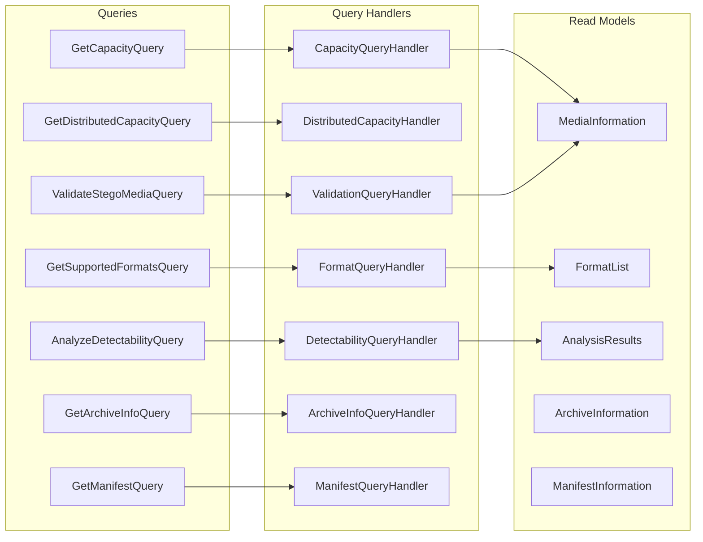
```mermaid
graph LR
    subgraph "Queries"
        CapQuery[GetCapacityQuery]
        DistCapQuery[GetDistributedCapacityQuery]
        ValidQuery[ValidateStegoMediaQuery]
        FormatQuery[GetSupportedFormatsQuery]
        DetectQuery[AnalyzeDetectabilityQuery]
        ArchiveQuery[GetArchiveInfoQuery]
        ManifestQuery[GetManifestQuery]
    end

    subgraph "Query Handlers"
        CapHandler[CapacityQueryHandler]
        DistCapHandler[DistributedCapacityHandler]
        ValidHandler[ValidationQueryHandler]
        FormatHandler[FormatQueryHandler]
        DetectHandler[DetectabilityQueryHandler]
        ArchiveHandler[ArchiveInfoQueryHandler]
        ManifestHandler[ManifestQueryHandler]
    end

    subgraph "Read Models"
        MediaInfo[MediaInformation]
        FormatList[FormatList]
        Analysis[AnalysisResults]
        ArchiveInfo[ArchiveInformation]
        ManifestInfo[ManifestInformation]
    end

    CapQuery --> CapHandler
    DistCapQuery --> DistCapHandler
    ValidQuery --> ValidHandler
    FormatQuery --> FormatHandler
    DetectQuery --> DetectHandler
    ArchiveQuery --> ArchiveHandler
    ManifestQuery --> ManifestHandler

    CapHandler --> MediaInfo
    ValidHandler --> MediaInfo
    FormatHandler --> FormatList
    DetectHandler --> Analysis
```

---

## Security Pipeline

### One-to-One Encryption Pipeline

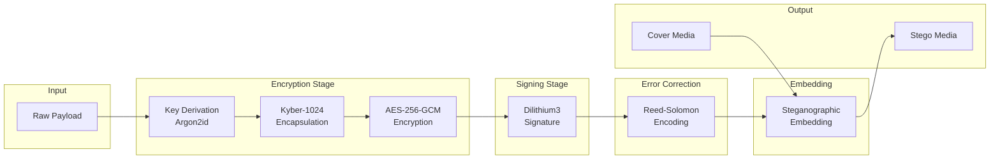
```mermaid
graph LR
    subgraph "Input"
        Raw[Raw Payload]
    end

    subgraph "Encryption Stage"
        KDF[Key Derivation<br/>Argon2id]
        Kyber[Kyber-1024<br/>Encapsulation]
        AES[AES-256-GCM<br/>Encryption]
    end

    subgraph "Signing Stage"
        Dilithium[Dilithium3<br/>Signature]
    end

    subgraph "Error Correction"
        RS[Reed-Solomon<br/>Encoding]
    end

    subgraph "Embedding"
        Stego[Steganographic<br/>Embedding]
    end

    subgraph "Output"
        Cover[Cover Media]
        StegoMedia[Stego Media]
    end

    Raw --> KDF
    KDF --> Kyber
    Kyber --> AES
    AES --> Dilithium
    Dilithium --> RS
    RS --> Stego
    Cover --> Stego
    Stego --> StegoMedia
```

### Distributed Pipeline (One-to-Many)

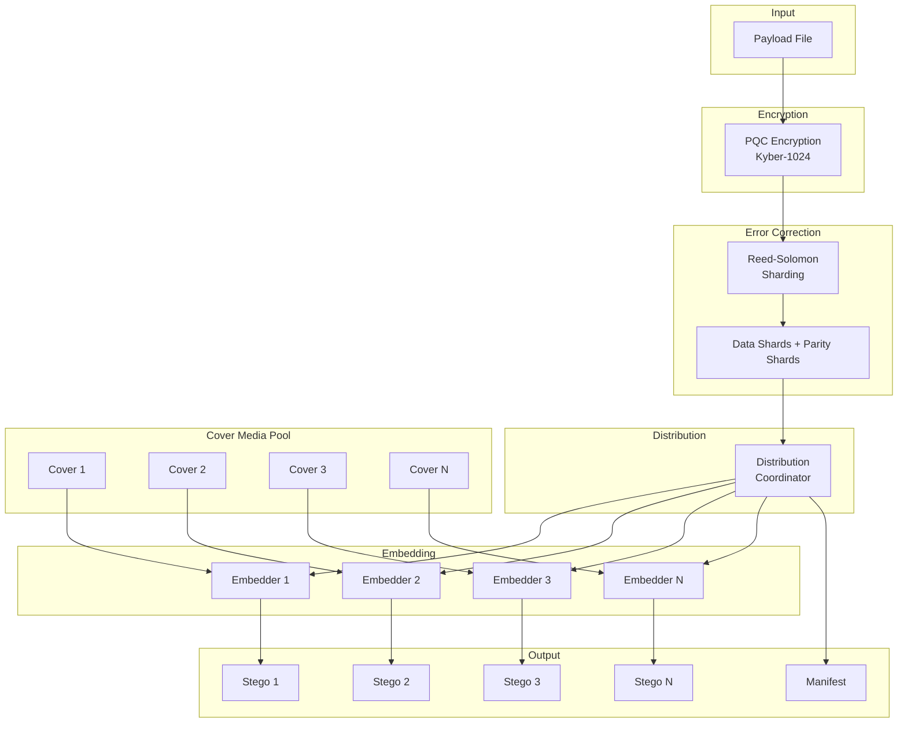
```mermaid
graph TB
    subgraph "Input"
        Payload[Payload File]
    end

    subgraph "Encryption"
        Encrypt[PQC Encryption<br/>Kyber-1024]
    end

    subgraph "Error Correction"
        RS[Reed-Solomon<br/>Sharding]
        Shards[Data Shards + Parity Shards]
    end

    subgraph "Distribution"
        Coordinator[Distribution<br/>Coordinator]
    end

    subgraph "Cover Media Pool"
        Cover1[Cover 1]
        Cover2[Cover 2]
        Cover3[Cover 3]
        CoverN[Cover N]
    end

    subgraph "Embedding"
        Embed1[Embedder 1]
        Embed2[Embedder 2]
        Embed3[Embedder 3]
        EmbedN[Embedder N]
    end

    subgraph "Output"
        Stego1[Stego 1]
        Stego2[Stego 2]
        Stego3[Stego 3]
        StegoN[Stego N]
        Manifest[Manifest]
    end

    Payload --> Encrypt
    Encrypt --> RS
    RS --> Shards
    Shards --> Coordinator

    Coordinator --> Embed1
    Coordinator --> Embed2
    Coordinator --> Embed3
    Coordinator --> EmbedN

    Cover1 --> Embed1
    Cover2 --> Embed2
    Cover3 --> Embed3
    CoverN --> EmbedN

    Embed1 --> Stego1
    Embed2 --> Stego2
    Embed3 --> Stego3
    EmbedN --> StegoN

    Coordinator --> Manifest
```

### Key Management

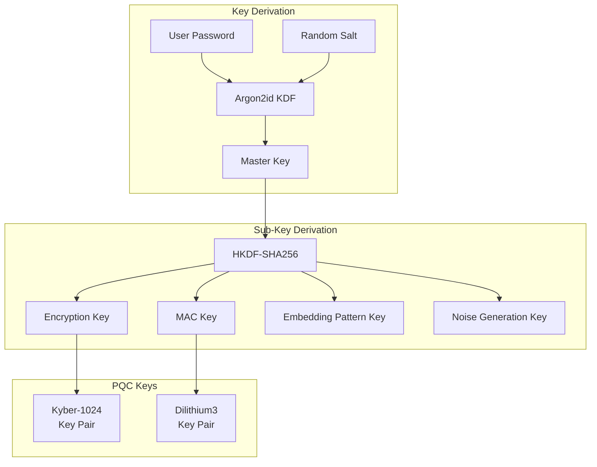
```mermaid
graph TB
    subgraph "Key Derivation"
        Password[User Password]
        Salt[Random Salt]
        Argon2[Argon2id KDF]
        MasterKey[Master Key]

        Password --> Argon2
        Salt --> Argon2
        Argon2 --> MasterKey
    end

    subgraph "Sub-Key Derivation"
        HKDF[HKDF-SHA256]
        EncKey[Encryption Key]
        MACKey[MAC Key]
        EmbedKey[Embedding Pattern Key]
        NoiseKey[Noise Generation Key]

        MasterKey --> HKDF
        HKDF --> EncKey
        HKDF --> MACKey
        HKDF --> EmbedKey
        HKDF --> NoiseKey
    end

    subgraph "PQC Keys"
        KyberKP[Kyber-1024<br/>Key Pair]
        DilithiumKP[Dilithium3<br/>Key Pair]

        EncKey --> KyberKP
        MACKey --> DilithiumKP
    end
```

---

## Distribution Patterns

### Pattern Comparison


```mermaid
graph TB
    subgraph "One-to-One"
        O2O_In[1 Payload]
        O2O_Cover[1 Cover]
        O2O_Out[1 Stego]

        O2O_In --> O2O_Cover
        O2O_Cover --> O2O_Out
    end

    subgraph "One-to-Many"
        O2M_In[1 Payload]
        O2M_Shard[N Shards]
        O2M_Cover1[Cover 1]
        O2M_Cover2[Cover 2]
        O2M_CoverN[Cover N]
        O2M_Out1[Stego 1]
        O2M_Out2[Stego 2]
        O2M_OutN[Stego N]

        O2M_In --> O2M_Shard
        O2M_Shard --> O2M_Cover1
        O2M_Shard --> O2M_Cover2
        O2M_Shard --> O2M_CoverN
        O2M_Cover1 --> O2M_Out1
        O2M_Cover2 --> O2M_Out2
        O2M_CoverN --> O2M_OutN
    end

    subgraph "Many-to-One"
        M2O_In1[Payload 1]
        M2O_In2[Payload 2]
        M2O_InN[Payload N]
        M2O_Cover[1 Cover]
        M2O_Out[1 Stego]

        M2O_In1 --> M2O_Cover
        M2O_In2 --> M2O_Cover
        M2O_InN --> M2O_Cover
        M2O_Cover --> M2O_Out
    end

    subgraph "Many-to-Many"
        M2M_In1[Payload 1]
        M2M_In2[Payload 2]
        M2M_Cover1[Cover 1]
        M2M_Cover2[Cover 2]
        M2M_Out1[Stego 1]
        M2M_Out2[Stego 2]

        M2M_In1 --> M2M_Cover1
        M2M_In1 --> M2M_Cover2
        M2M_In2 --> M2M_Cover1
        M2M_In2 --> M2M_Cover2
        M2M_Cover1 --> M2M_Out1
        M2M_Cover2 --> M2M_Out2
    end
```

### Threshold Recovery (K of N)

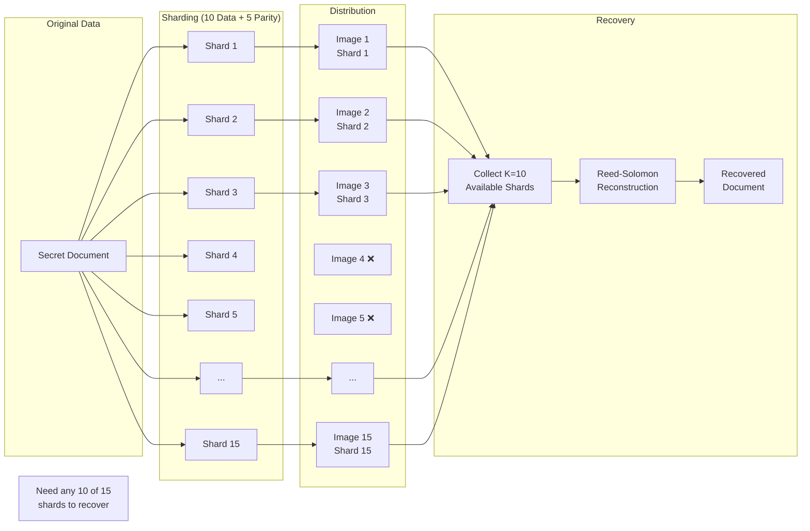
```mermaid
graph LR
    subgraph "Original Data"
        Data[Secret Document]
    end

    subgraph "Sharding (10 Data + 5 Parity)"
        S1[Shard 1]
        S2[Shard 2]
        S3[Shard 3]
        S4[Shard 4]
        S5[Shard 5]
        S6[...]
        S15[Shard 15]
    end

    subgraph "Distribution"
        Stego1[Image 1<br/>Shard 1]
        Stego2[Image 2<br/>Shard 2]
        Stego3[Image 3<br/>Shard 3]
        Lost1[Image 4 ❌]
        Lost2[Image 5 ❌]
        Stego6[...]
        Stego15[Image 15<br/>Shard 15]
    end

    subgraph "Recovery"
        Collect[Collect K=10<br/>Available Shards]
        RS[Reed-Solomon<br/>Reconstruction]
        Recovered[Recovered<br/>Document]
    end

    Data --> S1
    Data --> S2
    Data --> S3
    Data --> S4
    Data --> S5
    Data --> S6
    Data --> S15

    S1 --> Stego1
    S2 --> Stego2
    S3 --> Stego3
    S6 --> Stego6
    S15 --> Stego15

    Stego1 --> Collect
    Stego2 --> Collect
    Stego3 --> Collect
    Stego6 --> Collect
    Stego15 --> Collect

    Collect --> RS
    RS --> Recovered

    Note1[Need any 10 of 15<br/>shards to recover]
```

---

## Data Flow Diagrams

### CLI Embed Flow

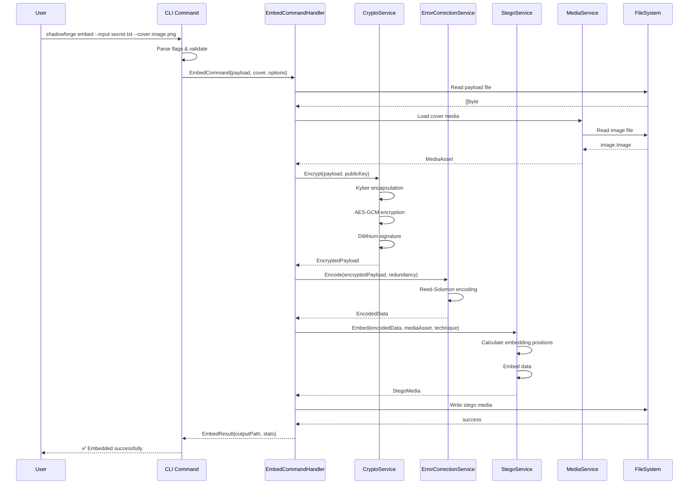
```mermaid
sequenceDiagram
    participant User
    participant CLI as CLI Command
    participant Handler as EmbedCommandHandler
    participant Crypto as CryptoService
    participant EC as ErrorCorrectionService
    participant Stego as StegoService
    participant Media as MediaService
    participant FS as FileSystem

    User->>CLI: shadowforge embed --input secret.txt --cover image.png
    CLI->>CLI: Parse flags & validate
    CLI->>Handler: EmbedCommand{payload, cover, options}

    Handler->>FS: Read payload file
    FS-->>Handler: []byte

    Handler->>Media: Load cover media
    Media->>FS: Read image file
    FS-->>Media: image.Image
    Media-->>Handler: MediaAsset

    Handler->>Crypto: Encrypt(payload, publicKey)
    Crypto->>Crypto: Kyber encapsulation
    Crypto->>Crypto: AES-GCM encryption
    Crypto->>Crypto: Dilithium signature
    Crypto-->>Handler: EncryptedPayload

    Handler->>EC: Encode(encryptedPayload, redundancy)
    EC->>EC: Reed-Solomon encoding
    EC-->>Handler: EncodedData

    Handler->>Stego: Embed(encodedData, mediaAsset, technique)
    Stego->>Stego: Calculate embedding positions
    Stego->>Stego: Embed data
    Stego-->>Handler: StegoMedia

    Handler->>FS: Write stego media
    FS-->>Handler: success

    Handler-->>CLI: EmbedResult{outputPath, stats}
    CLI-->>User: ✅ Embedded successfully
```

### API Distributed Embed Flow

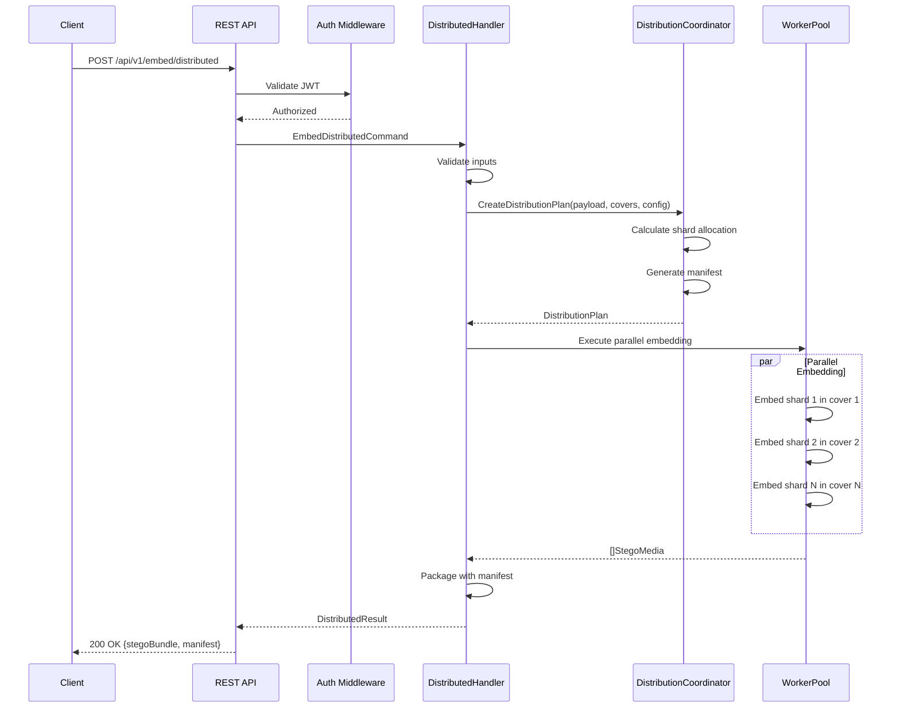
```mermaid
sequenceDiagram
    participant Client
    participant API as REST API
    participant Auth as Auth Middleware
    participant Handler as DistributedHandler
    participant Coord as DistributionCoordinator
    participant Pool as WorkerPool

    Client->>API: POST /api/v1/embed/distributed
    API->>Auth: Validate JWT
    Auth-->>API: Authorized

    API->>Handler: EmbedDistributedCommand
    Handler->>Handler: Validate inputs

    Handler->>Coord: CreateDistributionPlan(payload, covers, config)
    Coord->>Coord: Calculate shard allocation
    Coord->>Coord: Generate manifest
    Coord-->>Handler: DistributionPlan

    Handler->>Pool: Execute parallel embedding

    par Parallel Embedding
        Pool->>Pool: Embed shard 1 in cover 1
        Pool->>Pool: Embed shard 2 in cover 2
        Pool->>Pool: Embed shard N in cover N
    end

    Pool-->>Handler: []StegoMedia

    Handler->>Handler: Package with manifest
    Handler-->>API: DistributedResult

    API-->>Client: 200 OK {stegoBundle, manifest}
```

---

## Component Interactions

### Steganography Technique Selection

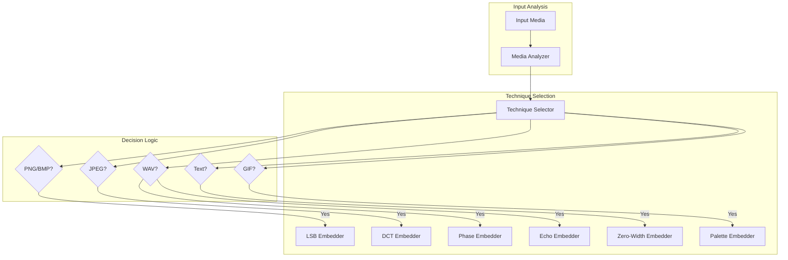
```mermaid
graph TB
    subgraph "Input Analysis"
        Media[Input Media]
        Analyze[Media Analyzer]

        Media --> Analyze
    end

    subgraph "Technique Selection"
        Selector[Technique Selector]

        LSB[LSB Embedder]
        DCT[DCT Embedder]
        Phase[Phase Embedder]
        Echo[Echo Embedder]
        ZeroWidth[Zero-Width Embedder]
        Palette[Palette Embedder]
    end

    subgraph "Decision Logic"
        PNG{PNG/BMP?}
        JPEG{JPEG?}
        WAV{WAV?}
        TXT{Text?}
        GIF{GIF?}
    end

    Analyze --> Selector
    Selector --> PNG
    Selector --> JPEG
    Selector --> WAV
    Selector --> TXT
    Selector --> GIF

    PNG -->|Yes| LSB
    JPEG -->|Yes| DCT
    WAV -->|Yes| Phase
    WAV -->|Yes| Echo
    TXT -->|Yes| ZeroWidth
    GIF -->|Yes| Palette
```

### Archive Processing Flow

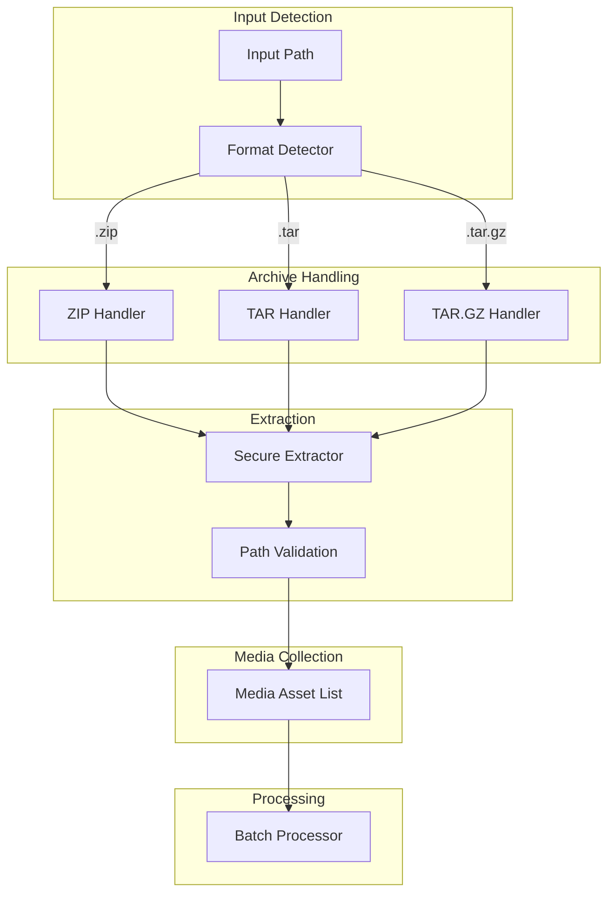
```mermaid
graph TB
    subgraph "Input Detection"
        Input[Input Path]
        Detector[Format Detector]

        Input --> Detector
    end

    subgraph "Archive Handling"
        ZIP[ZIP Handler]
        TAR[TAR Handler]
        TARGZ[TAR.GZ Handler]

        Detector -->|.zip| ZIP
        Detector -->|.tar| TAR
        Detector -->|.tar.gz| TARGZ
    end

    subgraph "Extraction"
        Extractor[Secure Extractor]
        Validation[Path Validation]

        ZIP --> Extractor
        TAR --> Extractor
        TARGZ --> Extractor

        Extractor --> Validation
    end

    subgraph "Media Collection"
        MediaList[Media Asset List]

        Validation --> MediaList
    end

    subgraph "Processing"
        Processor[Batch Processor]

        MediaList --> Processor
    end
```

---

## Technology Stack

### Dependencies Overview

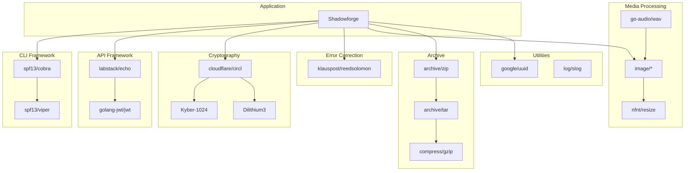
```mermaid
graph TB
    subgraph "Application"
        Shadowforge[Shadowforge]
    end

    subgraph "CLI Framework"
        Cobra[spf13/cobra]
        Viper[spf13/viper]
    end

    subgraph "API Framework"
        Echo[labstack/echo]
        JWT[golang-jwt/jwt]
    end

    subgraph "Cryptography"
        CIRCL[cloudflare/circl]
        Kyber[Kyber-1024]
        Dilithium[Dilithium3]
    end

    subgraph "Error Correction"
        RS[klauspost/reedsolomon]
    end

    subgraph "Media Processing"
        ImageStd[image/*]
        Audio[go-audio/wav]
        Resize[nfnt/resize]
    end

    subgraph "Archive"
        ArchiveZIP[archive/zip]
        ArchiveTAR[archive/tar]
        Gzip[compress/gzip]
    end

    subgraph "Utilities"
        UUID[google/uuid]
        Slog[log/slog]
    end

    Shadowforge --> Cobra
    Shadowforge --> Echo
    Shadowforge --> CIRCL
    Shadowforge --> RS
    Shadowforge --> ImageStd
    Shadowforge --> ArchiveZIP
    Shadowforge --> UUID

    Cobra --> Viper
    Echo --> JWT
    CIRCL --> Kyber
    CIRCL --> Dilithium
    ImageStd --> Resize
    Audio --> ImageStd
    ArchiveZIP --> ArchiveTAR
    ArchiveTAR --> Gzip
```

### Security Architecture

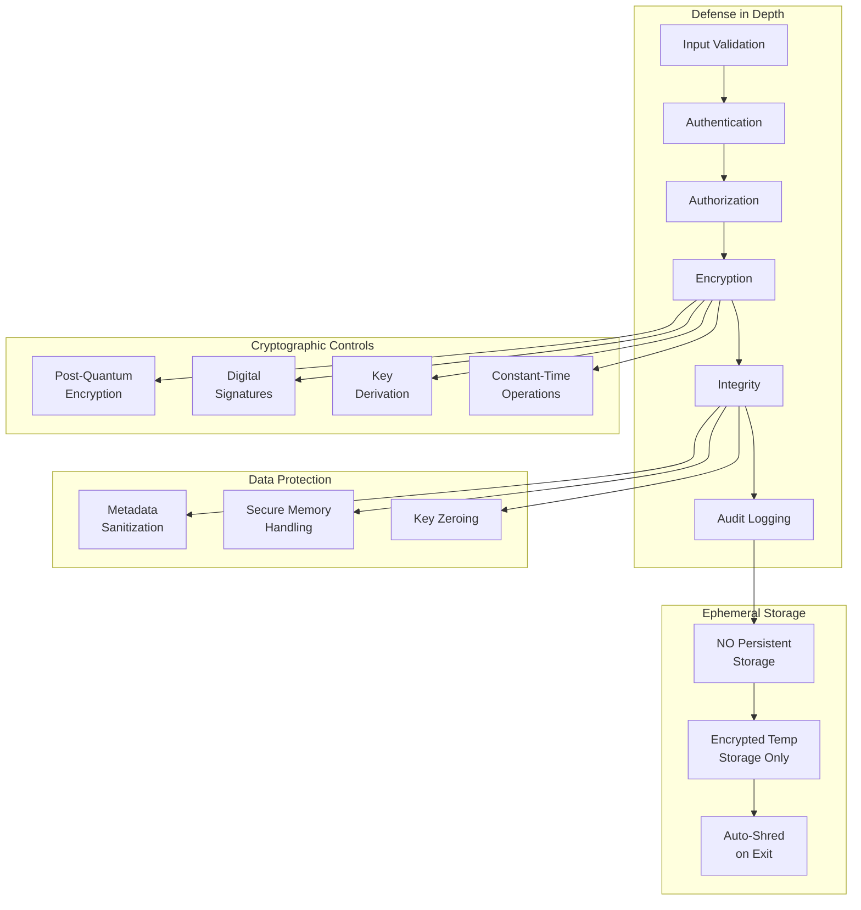
```mermaid
graph TB
    subgraph "Defense in Depth"
        Layer1[Input Validation]
        Layer2[Authentication]
        Layer3[Authorization]
        Layer4[Encryption]
        Layer5[Integrity]
        Layer6[Audit Logging]
    end

    subgraph "Cryptographic Controls"
        PQC[Post-Quantum<br/>Encryption]
        Signatures[Digital<br/>Signatures]
        KDF[Key<br/>Derivation]
        ConstTime[Constant-Time<br/>Operations]
    end

    subgraph "Data Protection"
        Sanitize[Metadata<br/>Sanitization]
        SecureMem[Secure Memory<br/>Handling]
        KeyZero[Key Zeroing]
    end

    subgraph "Ephemeral Storage"
        NoPersis[NO Persistent<br/>Storage]
        EncTemp[Encrypted Temp<br/>Storage Only]
        AutoShred[Auto-Shred<br/>on Exit]
    end

    Layer1 --> Layer2
    Layer2 --> Layer3
    Layer3 --> Layer4
    Layer4 --> Layer5
    Layer5 --> Layer6

    Layer4 --> PQC
    Layer4 --> Signatures
    Layer4 --> KDF
    Layer4 --> ConstTime

    Layer5 --> Sanitize
    Layer5 --> SecureMem
    Layer5 --> KeyZero

    Layer6 --> NoPersis
    NoPersis --> EncTemp
    EncTemp --> AutoShred
```

### Ephemeral Storage Model

**⚠️ CRITICAL SECURITY DECISION: NO PERSISTENT STORAGE**

Shadowforge follows an **ephemeral-only** storage model:

```
┌──────────────────────────────────────────────────────┐
│ "If it's not in RAM actively being processed,       │
│  it shouldn't exist at all."                         │
└──────────────────────────────────────────────────────┘
```

**Storage by Deployment Mode:**

| Mode | Storage Pattern | Security Properties |
|------|----------------|---------------------|
| **CLI** | Direct file I/O, NO repository | ✅ Zero persistence<br/>✅ User-controlled files<br/>✅ Secure memory zeroing |
| **API** | EncryptedTempRepository<br/>(tmpfs, 5-min TTL) | ✅ Encrypted at rest<br/>✅ Session-scoped keys<br/>✅ Auto-delete on send |
| **Tests** | MemoryRepository<br/>(⚠️ TEST ONLY) | ⚠️ No encryption<br/>⚠️ No persistence<br/>✅ Fast isolation |

**Production repositories (PostgreSQL, S3) are EXPLICITLY NOT USED** to prevent:
- Forensic evidence creation
- Server seizure data exposure
- Database compromise attacks
- Insider data exfiltration

See [Security Hardening Guide](guides/security.md) for complete design and security considerations.

---

## State Machines

### Embedding State Machine

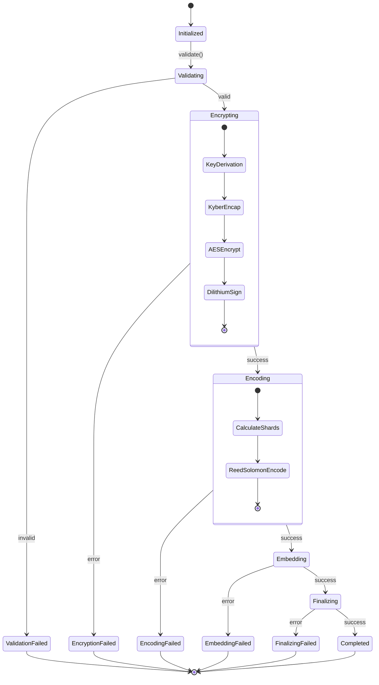
```mermaid
stateDiagram-v2
    [*] --> Initialized

    Initialized --> Validating : validate()
    Validating --> ValidationFailed : invalid
    Validating --> Encrypting : valid

    ValidationFailed --> [*]

    Encrypting --> EncryptionFailed : error
    Encrypting --> Encoding : success

    EncryptionFailed --> [*]

    Encoding --> EncodingFailed : error
    Encoding --> Embedding : success

    EncodingFailed --> [*]

    Embedding --> EmbeddingFailed : error
    Embedding --> Finalizing : success

    EmbeddingFailed --> [*]

    Finalizing --> Completed : success
    Finalizing --> FinalizingFailed : error

    FinalizingFailed --> [*]
    Completed --> [*]

    state Encrypting {
        [*] --> KeyDerivation
        KeyDerivation --> KyberEncap
        KyberEncap --> AESEncrypt
        AESEncrypt --> DilithiumSign
        DilithiumSign --> [*]
    }

    state Encoding {
        [*] --> CalculateShards
        CalculateShards --> ReedSolomonEncode
        ReedSolomonEncode --> [*]
    }
```

### Extraction State Machine

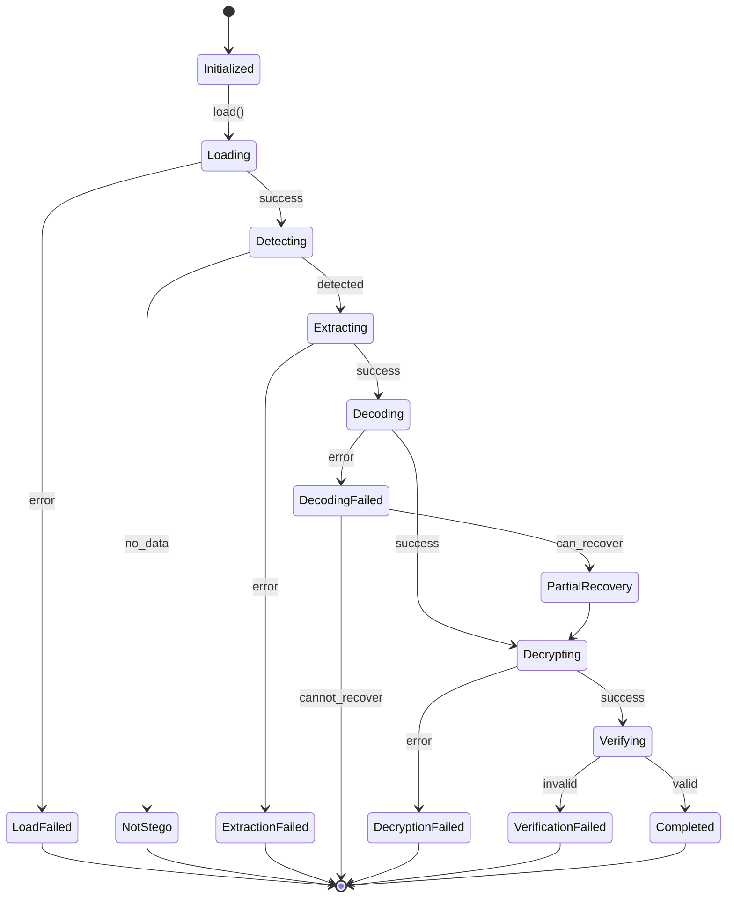
```mermaid
stateDiagram-v2
    [*] --> Initialized

    Initialized --> Loading : load()
    Loading --> LoadFailed : error
    Loading --> Detecting : success

    LoadFailed --> [*]

    Detecting --> NotStego : no_data
    Detecting --> Extracting : detected

    NotStego --> [*]

    Extracting --> ExtractionFailed : error
    Extracting --> Decoding : success

    ExtractionFailed --> [*]

    Decoding --> DecodingFailed : error
    Decoding --> Decrypting : success

    DecodingFailed --> PartialRecovery : can_recover
    DecodingFailed --> [*] : cannot_recover

    PartialRecovery --> Decrypting

    Decrypting --> DecryptionFailed : error
    Decrypting --> Verifying : success

    DecryptionFailed --> [*]

    Verifying --> VerificationFailed : invalid
    Verifying --> Completed : valid

    VerificationFailed --> [*]
    Completed --> [*]
```

---

## API Design

### REST API Endpoints

```mermaid
graph LR
    subgraph "Embed Endpoints"
        E1[POST /api/v1/embed]
        E2[POST /api/v1/embed/distributed]
        E3[POST /api/v1/embed/batch]
        E4[POST /api/v1/embed/matrix]
        E5[POST /api/v1/embed/archive]
    end

    subgraph "Extract Endpoints"
        X1[GET /api/v1/extract/id]
        X2[POST /api/v1/extract/distributed]
        X3[POST /api/v1/extract/batch]
        X4[POST /api/v1/extract/archive]
    end

    subgraph "Analysis Endpoints"
        A1[POST /api/v1/analyze/capacity]
        A2[POST /api/v1/validate]
    end

    subgraph "Utility Endpoints"
        U1[POST /api/v1/keygen]
        U2[GET /api/v1/formats]
        U3[GET /api/v1/health]
    end

    subgraph "Archive Endpoints"
        AR1[POST /api/v1/archive/create]
        AR2[POST /api/v1/archive/extract]
        AR3[POST /api/v1/archive/list]
    end
```

### API Reference Table

| Method | Endpoint | Description |
|--------|----------|-------------|
| `POST` | `/api/v1/embed` | Embed payload in single carrier |
| `POST` | `/api/v1/embed/distributed` | Distribute across multiple carriers |
| `POST` | `/api/v1/embed/batch` | Process multiple embeds |
| `POST` | `/api/v1/embed/matrix` | N:M distribution pattern |
| `POST` | `/api/v1/embed/archive` | Process archive of carriers |
| `GET` | `/api/v1/extract/{id}` | Extract from single carrier |
| `POST` | `/api/v1/extract/distributed` | Reconstruct from multiple carriers |
| `POST` | `/api/v1/extract/batch` | Process multiple extractions |
| `POST` | `/api/v1/extract/archive` | Extract from archive |
| `POST` | `/api/v1/analyze/capacity` | Calculate embedding capacity |
| `POST` | `/api/v1/validate` | Validate stego media integrity |
| `POST` | `/api/v1/archive/create` | Create archive of stego media |
| `POST` | `/api/v1/archive/extract` | Extract archive contents |
| `POST` | `/api/v1/archive/list` | List archive contents |
| `POST` | `/api/v1/keygen` | Generate key pair |
| `GET` | `/api/v1/formats` | List supported formats |
| `GET` | `/api/v1/health` | Health check |

---

## Development Workflow

### Adding a New Command

```mermaid
flowchart TD
    Start([New Feature Request]) --> DefineCmd[Define Command Structure]
    DefineCmd --> CreateHandler[Create Command Handler]
    CreateHandler --> ImplService[Implement Domain Service Logic]
    ImplService --> AddEvents[Emit Domain Events]
    AddEvents --> UnitTests[Write Unit Tests]
    UnitTests --> IntegTests[Write Integration Tests]
    IntegTests --> CLI[Add CLI Interface]
    CLI --> API[Add API Endpoint]
    API --> Docs[Update Documentation]
    Docs --> End([Complete])

    style Start fill:#e1f5e1
    style End fill:#e1f5e1
    style UnitTests fill:#fff3cd
    style IntegTests fill:#fff3cd
```

### Adding a New Bounded Context

```mermaid
flowchart TD
    Start([New Context Needed]) --> DefineAgg[Define Aggregates & Entities]
    DefineAgg --> DefineVO[Define Value Objects]
    DefineVO --> DefineEvents[Define Domain Events]
    DefineEvents --> ImplRepo[Implement Repository]
    ImplRepo --> ImplService[Implement Domain Service]
    ImplService --> AddHandlers[Add Command/Query Handlers]
    AddHandlers --> IntegExisting[Integrate with Existing Contexts]
    IntegExisting --> Tests[Write Comprehensive Tests]
    Tests --> Docs[Update Architecture Docs]
    Docs --> End([Complete])

    style Start fill:#e1f5e1
    style End fill:#e1f5e1
    style Tests fill:#fff3cd
```

### Testing Strategy

```mermaid
graph TB
    subgraph "Unit Tests"
        UT1[Domain Logic Tests]
        UT2[Value Object Tests]
        UT3[Aggregate Tests]
        UT4[Service Tests]
    end

    subgraph "Integration Tests"
        IT1[Command Handler Tests]
        IT2[Query Handler Tests]
        IT3[Repository Tests]
        IT4[External Service Tests]
    end

    subgraph "E2E Tests"
        E2E1[CLI Workflow Tests]
        E2E2[API Workflow Tests]
        E2E3[Distribution Pattern Tests]
        E2E4[Error Recovery Tests]
    end

    subgraph "Security Tests"
        ST1[Cryptography Tests]
        ST2[Vulnerability Scans]
        ST3[Penetration Tests]
        ST4[Statistical Analysis Tests]
    end

    UT1 --> IT1
    UT2 --> IT1
    UT3 --> IT2
    UT4 --> IT2

    IT1 --> E2E1
    IT2 --> E2E2
    IT3 --> E2E3
    IT4 --> E2E4

    E2E1 --> ST1
    E2E2 --> ST2
    E2E3 --> ST3
    E2E4 --> ST4
```

---

## Conclusion

This architecture provides:

- **Security First**: Post-quantum cryptography with multiple layers of protection
- **Flexibility**: Four distribution patterns for different use cases
- **Resilience**: Reed-Solomon error correction for data recovery
- **Maintainability**: Clean Architecture with DDD and CQRS patterns
- **Extensibility**: Plugin-style technique implementations
- **Testability**: Comprehensive testing strategy at all levels
- **Documentation**: Living architecture documentation with visual diagrams

**Key Benefits:**

1. **Separation of Concerns**: Each bounded context handles its own domain logic
2. **Independent Scaling**: Commands and queries can scale independently
3. **Event-Driven**: Asynchronous processing and audit trails via domain events
4. **Future-Proof**: Quantum-resistant algorithms protect against future threats
5. **Polyglot Persistence**: Each context can use optimal storage strategy
6. **Developer Experience**: Clear patterns and comprehensive documentation

---

## Glossary

| Term | Definition |
|------|------------|
| **Aggregate** | DDD pattern: cluster of domain objects treated as a single unit |
| **Bounded Context** | DDD pattern: explicit boundary within which a domain model is valid |
| **Chi-Square Test** | Statistical test to detect non-uniform data distribution |
| **CQRS** | Command Query Responsibility Segregation pattern |
| **DCT** | Discrete Cosine Transform (used in JPEG steganography) |
| **Dilithium** | Post-quantum digital signature algorithm (NIST standard) |
| **Domain Event** | Something that happened in the domain that domain experts care about |
| **KEM** | Key Encapsulation Mechanism (cryptographic primitive) |
| **Kyber** | Post-quantum key encapsulation algorithm (NIST standard) |
| **LSB** | Least Significant Bit (basic steganography technique) |
| **PQC** | Post-Quantum Cryptography |
| **Reed-Solomon** | Error correction coding algorithm |
| **RS Analysis** | Regular-Singular analysis for steganography detection |
| **Shard** | A piece of data split using Reed-Solomon encoding |
| **Steganography** | Practice of concealing data within other non-secret data |
| **Value Object** | DDD pattern: immutable object that describes domain characteristics |

---

*Last Updated: December 2025*
